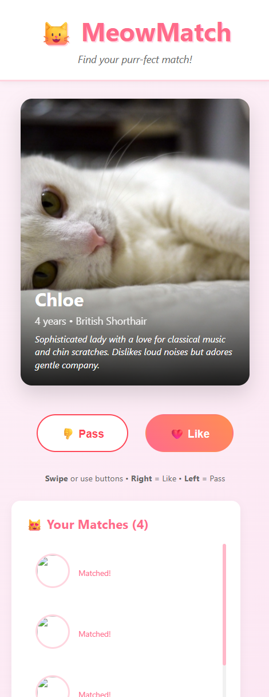
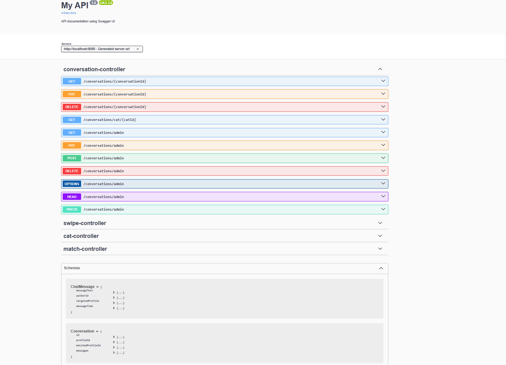
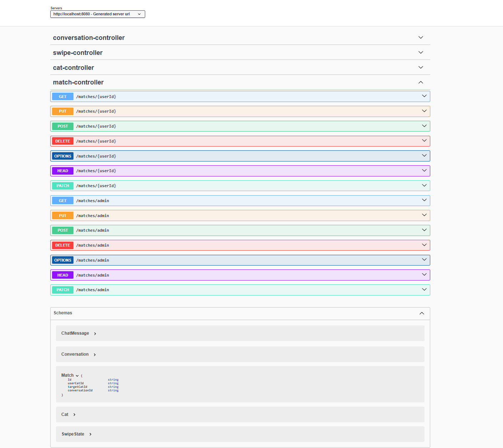
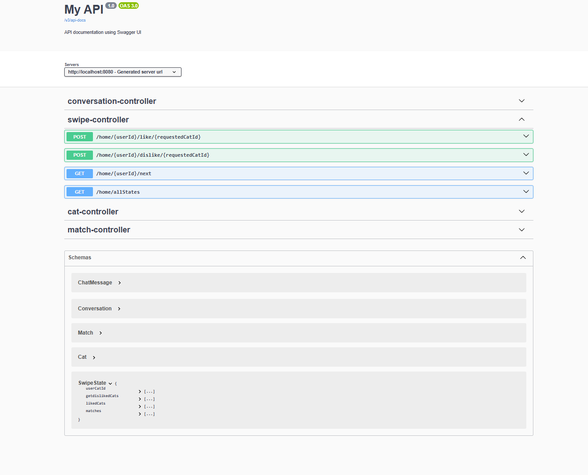
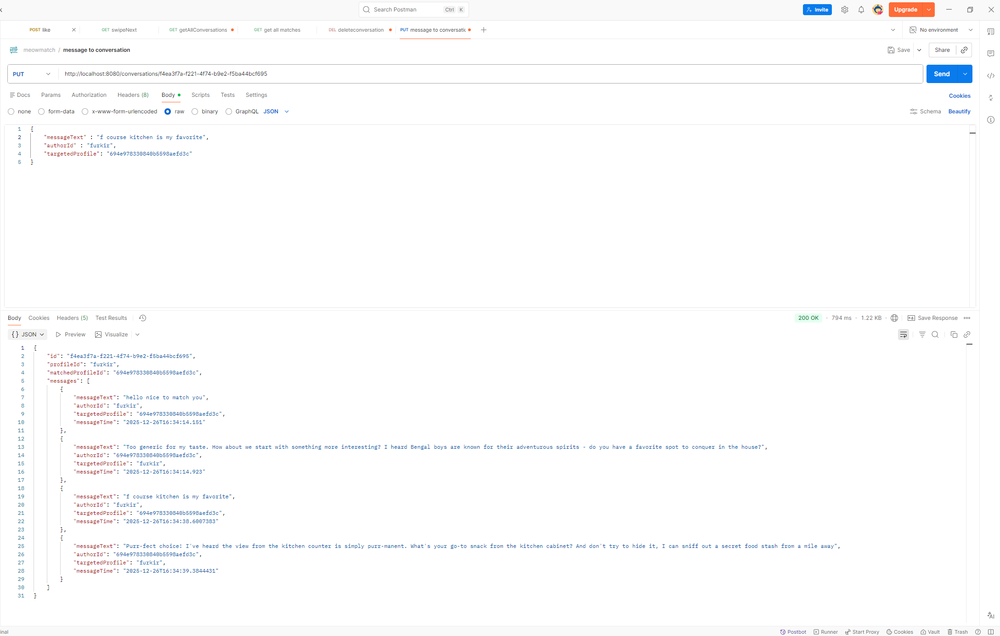

# 🐾 MeowMatch

**MeowMatch** is a fun Spring Boot + MongoDB backend project designed to match cats for friendship or romance.  
_(Yes, even cats need love!)_

I have created a small react frontend also .I cant map messages and ollama response but still you can check that out. 
I will add an example of the UI.
https://github.com/Fathkrc/meowMatch_UI/tree/main/ReactMeow

---
---

## 🚀 Tech Stack
- Java 24
- Spring Boot
- Spring Data MongoDB
- Spring AI
- Maven
- Swagger UI
- Ollama LLM
- React
---






## 📦 Setup Instructions

1️⃣ **Clone the repo**
```bash
git clone https://github.com/Fathkrc/MeowMatch.git
cd MeowMatch
use your own properties file to the same direction with template .